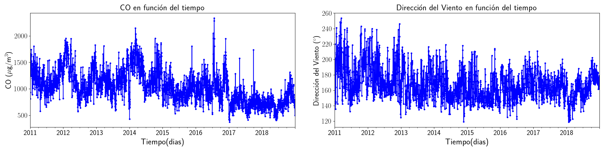
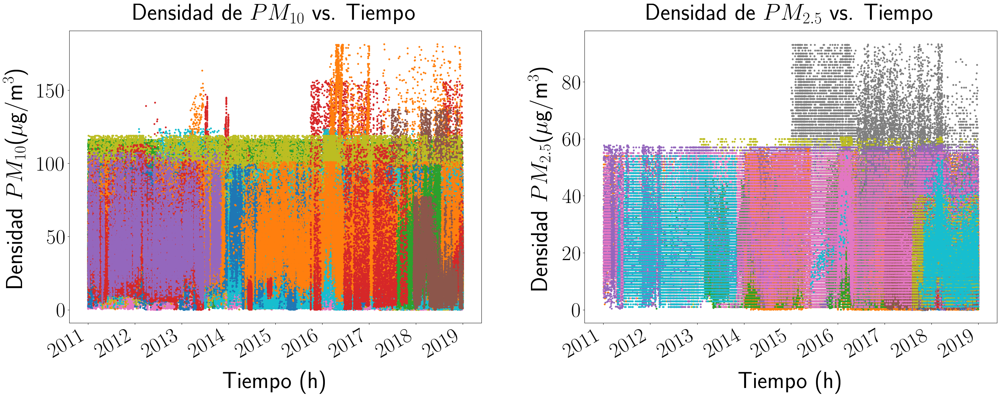
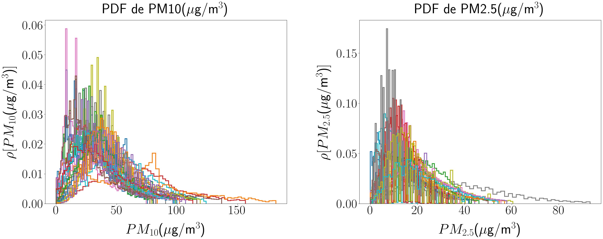
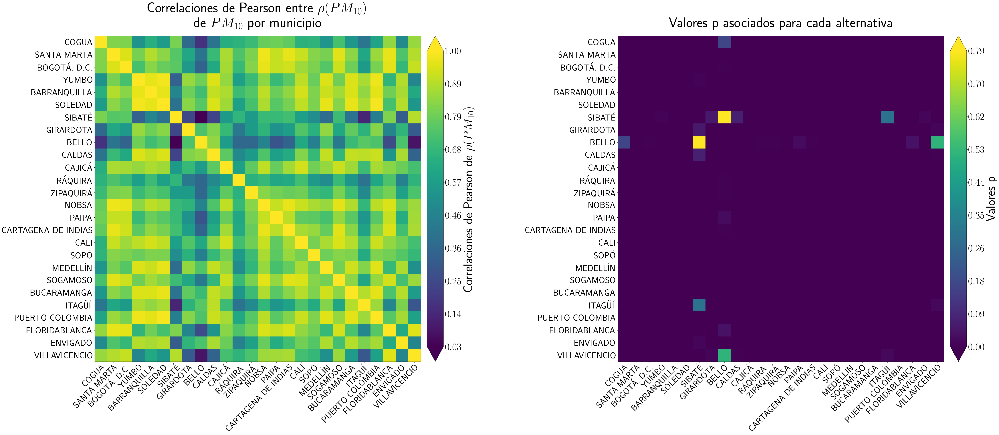
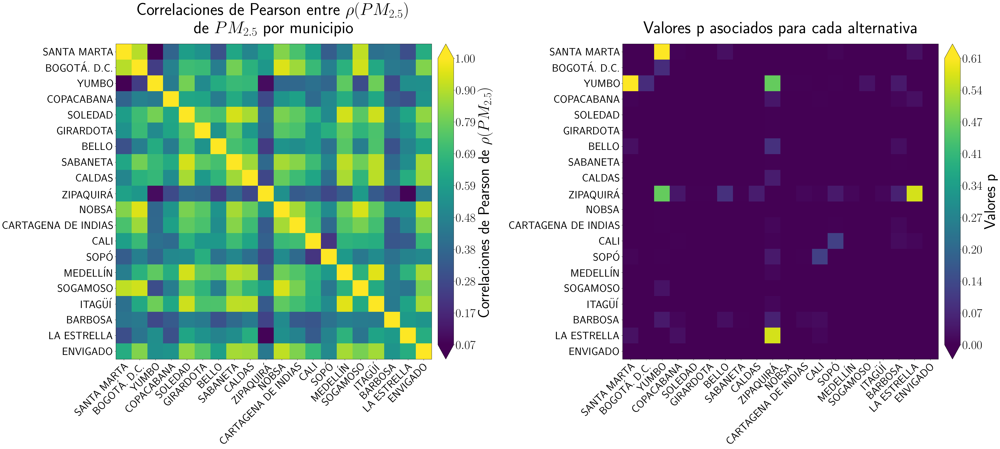
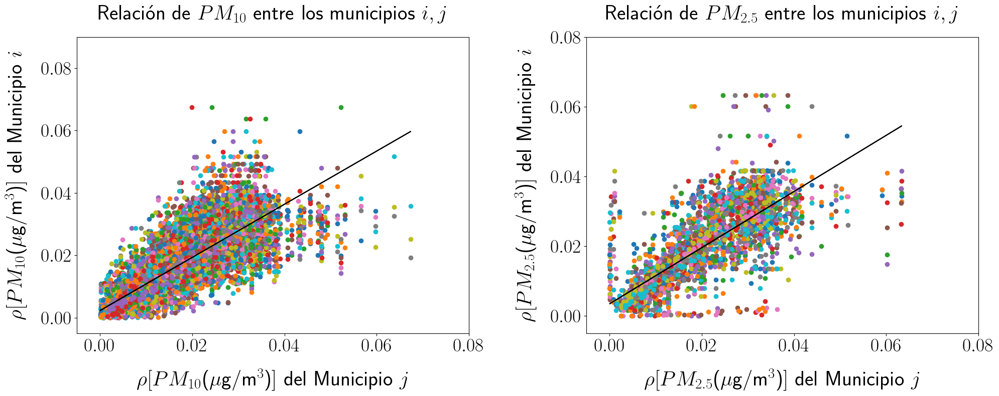
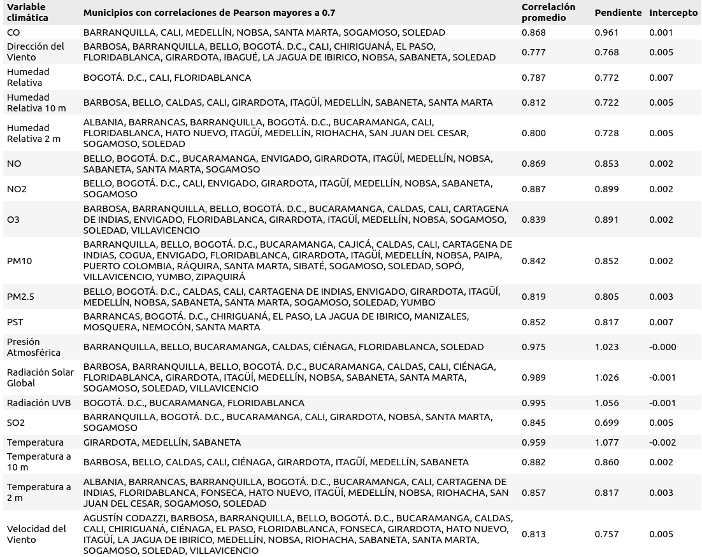

# DINÁMICAS CLIMÁTICAS EN MUNICIPIOS DE COLOMBIA

## Descripción

Este proyecto se centra en el análisis de un gran conjunto de datos climáticos que contiene **20 variables** relacionadas con la calidad del aire y las condiciones meteorológicas en diferentes municipios. 
El objetivo principal del proyecto es determinar si existe una relación entre cada una de estas variables climáticas y cómo interactúan entre sí en cada uno de los municipios estudiados.

A continuación se listan las variables de estudio:

- CO (Concentración de CO)
- Dirección del Viento
- Humedad Relativa
- Humedad Relativa a 10 m
- Humedad Relativa a 2 m
- NO (Concentración de NO)
- NO2 (Concentración de NO2)
- O3 (Concentración de O3)
- PM10 (Concentración de PM10)
- PM2.5 (Concentración de PM2.5)
- PST (Partículas en Suspensión Total)
- Precipitación Líquida
- Presión Atmosférica
- Radiación Solar Global
- Radiación UVB
- SO2 (Concentración de SO2)
- Temperatura
- Temperatura a 10 m
- Temperatura a 2 m
- Velocidad del Viento

## Objetivos del Proyecto

1. **Relaciones entre variables climáticas**: Evaluar si las variables climáticas están relacionadas entre sí dentro de cada municipio.
2. **Análisis de la calidad del aire**: Determinar el impacto de las concentraciones de contaminantes en la calidad del aire en diferentes localidades.
3. **Visualización de datos**: Presentar gráficamente la evolución de las variables climáticas a lo largo del tiempo.

## Metodología

Para abordar el análisis, se aplicarán técnicas estadísticas y de machine learning para explorar la relación entre las variables. Los pasos incluyen:

1. **Análisis Exploratorio de Datos (EDA)**: Se realizará un análisis descriptivo de cada variable, incluyendo su comportamiento a lo largo del tiempo en cada municipio, con el fin de identificar patrones iniciales o tendencias. Ejemplo de la variabilidad de una serie temporal:
   
   
   
3. **Correlación de Variables**: Se calculará la correlación entre las variables para cada municipio, utilizando matrices de correlación, coeficientes de Pearson y otros métodos estadísticos relevantes.

4. **Visualización de Datos**: Se generarán gráficos para visualizar la relación entre las variables y su evolución temporal, tales como gráficos de líneas, scatter plots y heatmaps para las correlaciones.

5. **Análisis de Tendencias**: Se investigarán las tendencias climáticas generales en cada municipio y cómo afectan el comportamiento de las variables. Se aplicarán modelos de regresión lineal y análisis de series temporales para identificar cambios a lo largo del tiempo.

6. **Interpretación de Resultados**: Se analizarán los resultados para determinar si existe una interdependencia significativa entre las variables en cada municipio. Este análisis puede proporcionar información valiosa sobre cómo ciertos eventos climáticos, como olas de calor o tormentas, podrían estar relacionados con otras variables.

## Resultados Esperados
Se espera identificar relaciones claras entre algunas variables climáticas que puedan estar influenciándose mutuamente en determinados municipios. Estos resultados podrían tener implicaciones importantes para la gestión de recursos naturales y la preparación para eventos climáticos extremos. Como ejemplo, los gráficos a continuación revelan detalles contundentes de nuestros hallazgos:

- Variable $PM_{10}$: $PM_{10}$ se refiere a partículas suspendidas en el aire que tienen un diámetro aerodinámico de 10 micrómetros (µm) o menos. Estas partículas son lo suficientemente pequeñas como para ser inhaladas y pueden penetrar en las vías respiratorias, lo que representa un riesgo para la salud humana y el medio ambiente.

### Efectos en la Salud

La exposición a niveles altos de PM10 puede tener varios efectos adversos en la salud, tales como:

Problemas respiratorios: Irritación de las vías respiratorias, agravamiento del asma y otras enfermedades pulmonares.
Enfermedades cardiovasculares: Aumento del riesgo de ataques cardíacos y accidentes cerebrovasculares.
Impactos en la salud pública: Contribución a la mortalidad prematura en poblaciones vulnerables.

---
<h3 align="center">
 Variación del $PM_{10,2.5}$ en funcion del tiempo
</h3>

---
<h3 align="center">
 Histogramas del $PM_{10,2.5}$
</h3> 

---
<h3 align="center">
Correlaciones de Pearson entre los histogramas del $PM_{10,2.5}$
</h3>

---

---
<h3 align="center">
Regresiones para las distribuciones del $PM_{10,2.5}$
</h3>

---

El análisis realizado hasta ahora muestra resultados prometedores al identificar correlaciones lineales significativas entre variables climáticas en diferentes municipios. Se ha logrado ajustar un modelo lineal bajo ciertas condiciones en casi todos los casos, con mínimas excepciones, lo que sugiere que las variables climáticas entre municipios tienden a seguir patrones lineales bajo ciertas circunstancias. Sin embargo, aún queda mucho por explorar. Debido a las limitaciones de tiempo, no se ha abordado el estudio de dinámicas no lineales, las cuales podrían revelar comportamientos más complejos y realistas de las variables climáticas.

## Tecnologías Utilizadas

El análisis de datos se realiza con las siguientes herramientas:

- **Python**: Lenguaje principal de programación para la limpieza, procesamiento y análisis de datos.
- **Pandas**: Para manipulación de datos y análisis exploratorio.
- **Matplotlib** y **Seaborn**: Para la visualización de datos.
- **Scikit-learn**: Para realizar modelos predictivos y análisis de correlación.
- **NumPy**: Para operaciones matemáticas y manipulación de arrays.

Más información aquí:
https://github.com/amolinacrn/ClimateDataAnalysis/blob/main/dinamicasClimaticas.ipynb
https://drive.google.com/drive/u/0/folders/1v7yHoZ8pHzL-7zmfeY-FhiBsbOG5XQvE
